# Image Preprocessing for Cell Analysis

This document outlines the preprocessing steps used in the cell analysis application to enhance microscope images for improved cell detection.

## Overview

The preprocessing pipeline applies various computer vision techniques to extract and enhance horizontal and vertical lines in microscope images. This process helps in identifying cell boundaries and grid structures, which is crucial for accurate cell counting and classification.

## Preprocessing Steps

### 1. Image Loading and Conversion
- Load the image using OpenCV.
- Convert the image to grayscale.

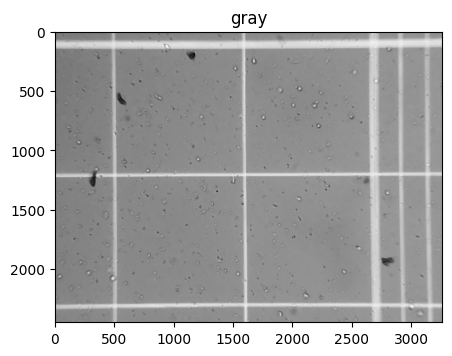

### 2. Gamma Correction

- Apply gamma correction to enhance image contrast.
- Gamma value: 1.5 (adjustable).

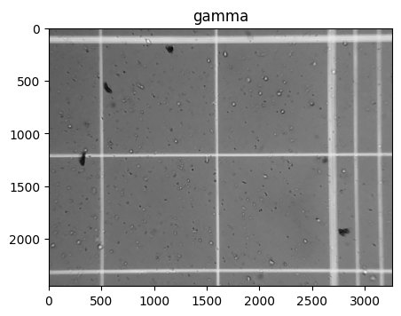

### 3. Noise Reduction

- Apply Gaussian blur with a kernel size of 15x15 for noise reduction.

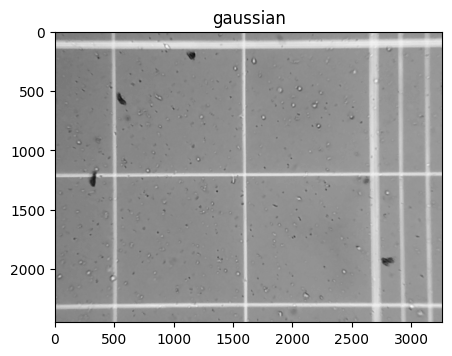

### 4. Thresholding

- Use Otsu's method for adaptive thresholding to create a binary image with inverted colors.

 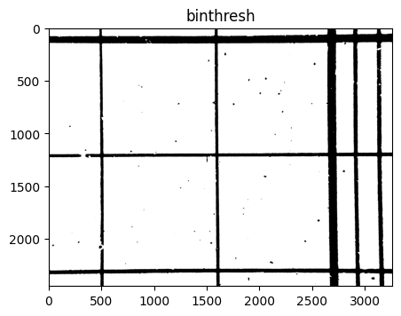 

### 5. Edge Detection and Smoothing

- Create horizontal and vertical structuring elements 
- Apply adaptive thresholding to extract edges.
- Sharpen edges using erosion and dilation.

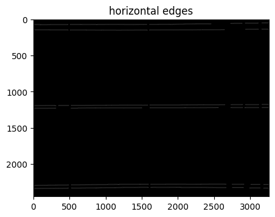
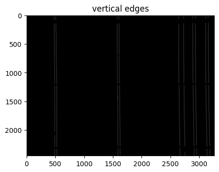

### 6. Line Detection

- Use Hough Transform to detect horizontal and vertical lines.
- Parameters:
  - Minimum line length: 200 pixels.
  - Maximum line gap: 50 pixels.
 
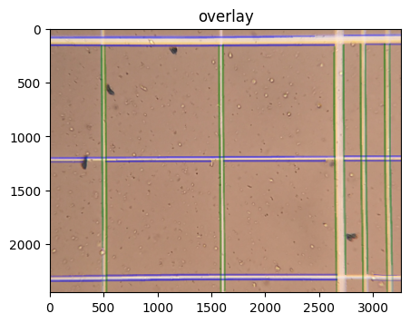

### 7. Line Coordinate Extraction

- Process detected lines to extract coordinates.
- Group lines into top, middle, and bottom sections.
- Use K-means clustering to refine line positions.

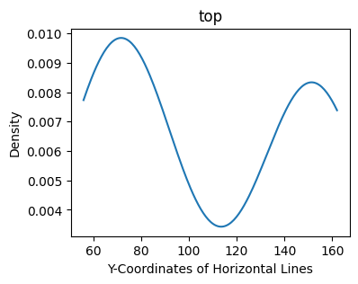
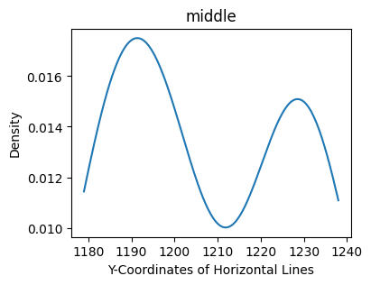
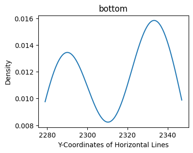

### 8. Grid Identification and Cropping

After detecting horizontal and vertical lines, the script identifies a 2x2 grid within the larger 4x4 grid structure:

1. **Coordinate Extraction**:
   - Extract coordinates for horizontal and vertical lines.

2. **Grid Position Identification**:
   - Determine if the 2x2 grid is in the top-left, top-right, bottom-left, or bottom-right position within the 4x4 grid.
   - This is done by comparing the thickness of the top and left lines.

3. **Quadrant Definition**:
   - Define four quadrants (A, B, C, D) based on the identified grid position.

4. **Image Cropping**:
   - Crop the original image into four separate images corresponding to the identified quadrants.

5. **Image Processing**:
   - Pad each cropped image to create a square canvas.
   - Resize images to a target size (960x960 pixels) if necessary, preserving aspect ratio.

6. **Output Generation**:
   - Save each processed quadrant image with a naming convention: `original_filename_[A/B/C/D].jpg`.

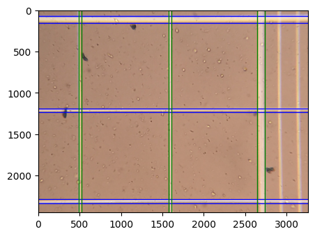

### 9. Visualization

- Plot the four cropped and processed images for visual verification.

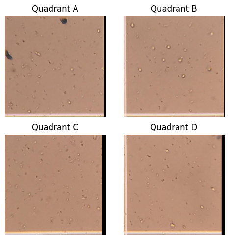

## Key Functions

1. `process_distribution`: Processes line coordinates to identify distinct groups.
2. `extract_horizontals`: Extracts and processes horizontal line coordinates.
3. `extract_verticals`: Extracts and processes vertical line coordinates.
4. `extractLines`: Main function that orchestrates the entire preprocessing pipeline, including line detection, grid identification, and image cropping.

## Output

The preprocessing steps result in:
1. An enhanced image with detected lines overlaid.
2. Four cropped images corresponding to the quadrants of the identified 2x2 grid.
3. Extracted coordinates of horizontal and vertical lines.

## Notes

- The effectiveness of grid detection and cropping can vary depending on the quality and clarity of the input images.
- The script assumes a specific grid structure (4x4 with an embedded 2x2). Adjustments may be needed for different grid layouts.
- Image padding and resizing ensure consistent output sizes while preserving aspect ratios.
